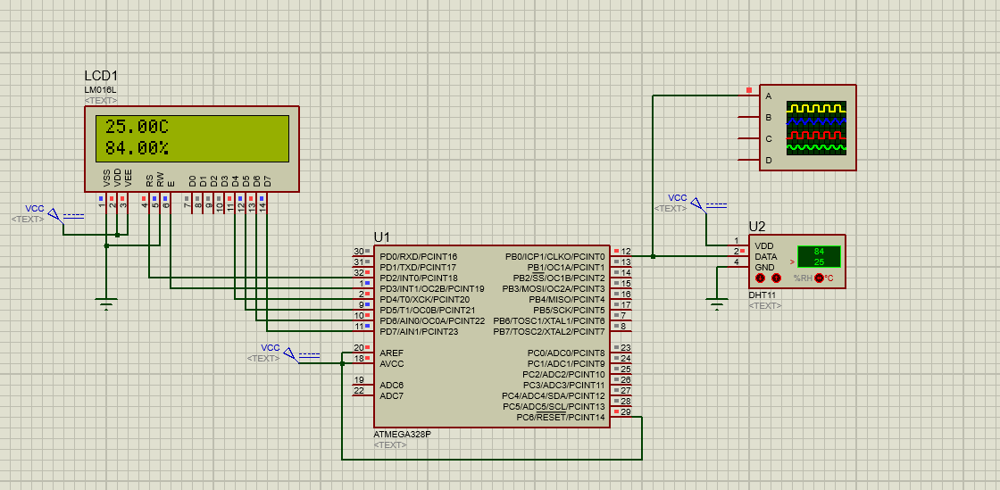
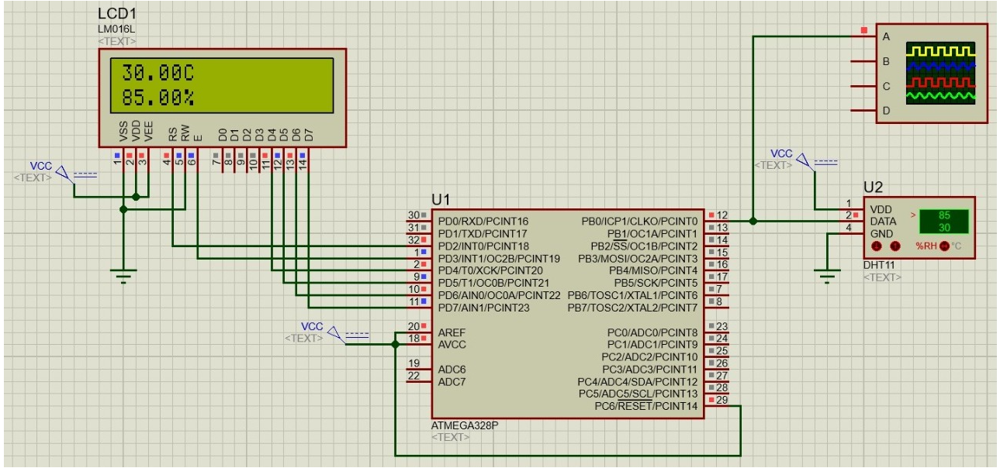
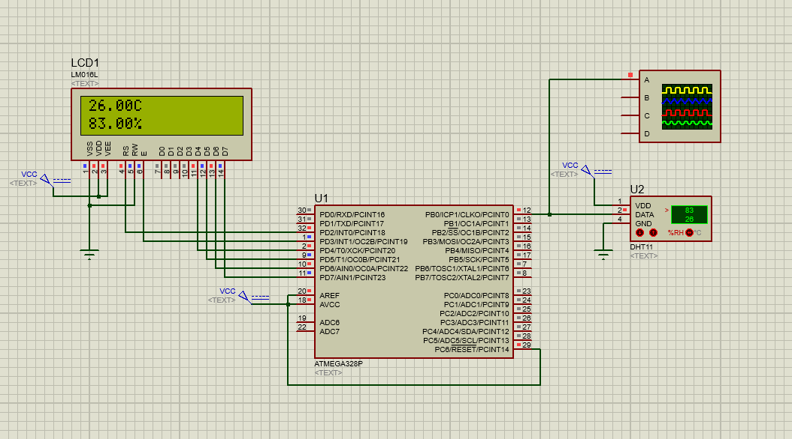

# DHT11

### Alumno: Horn Lautaro

### Curso: 5to 2da Aviónica

### Materia: Adquisición de Datos

***Ejemplo 1***

Datos:

- 80.00 % (Humedad)
- 26.00 °C (Grados Celsius)

***Ejemplo 2***

Datos:

- 90.00 % (Humedad)
- 25.00 °C (Grados Celsius)

***Ejemplo 3***

Datos:

- 85.00 % (Humedad)
- 30.00 °C (Grados Celsius)
